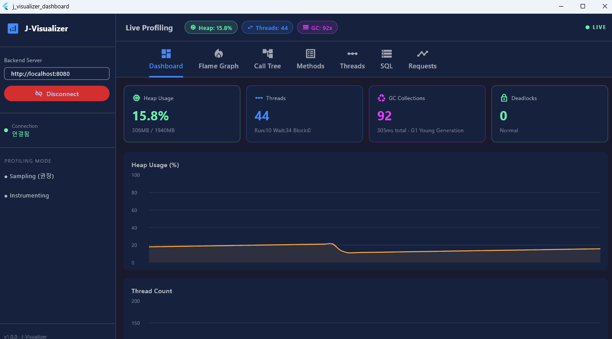
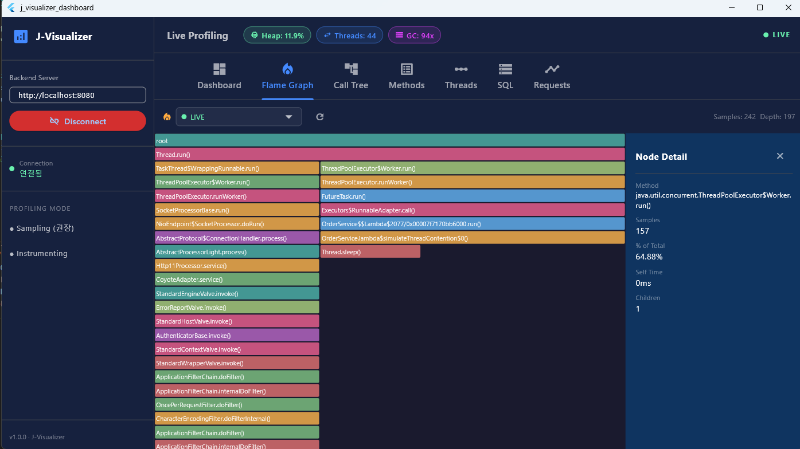
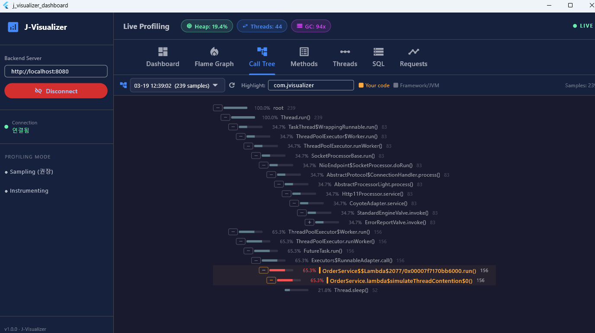
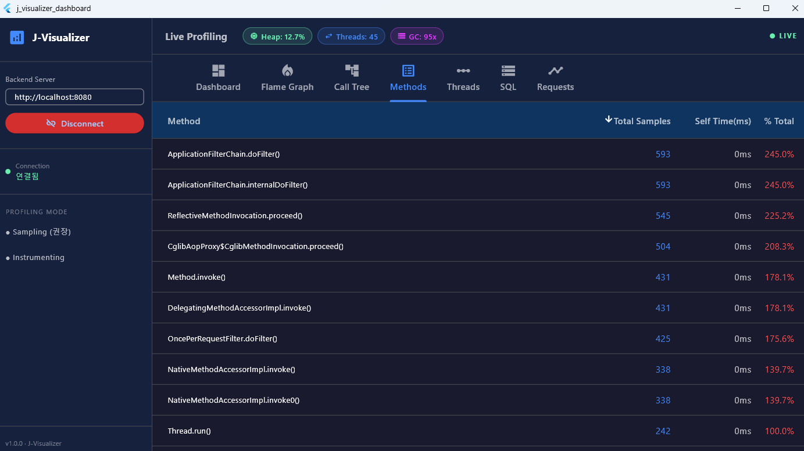
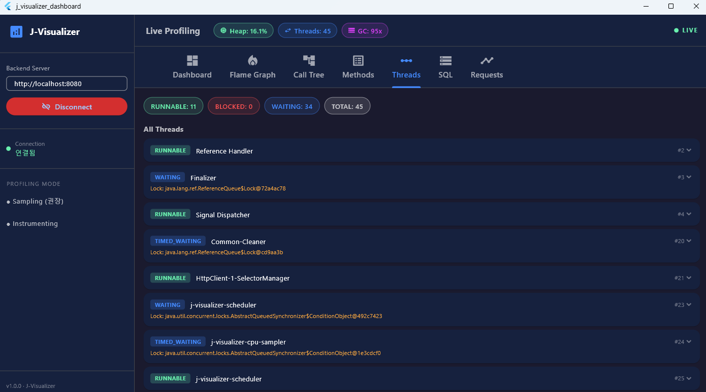
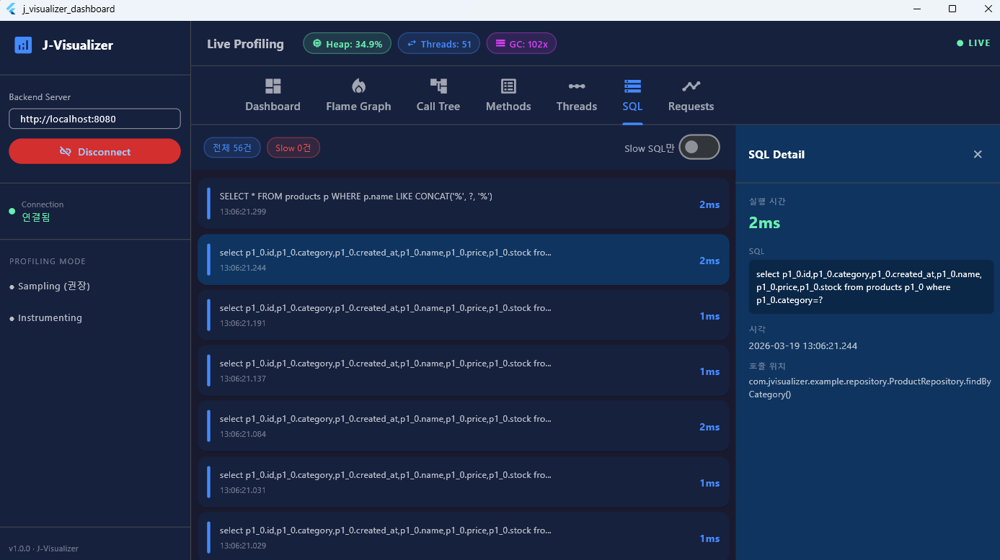
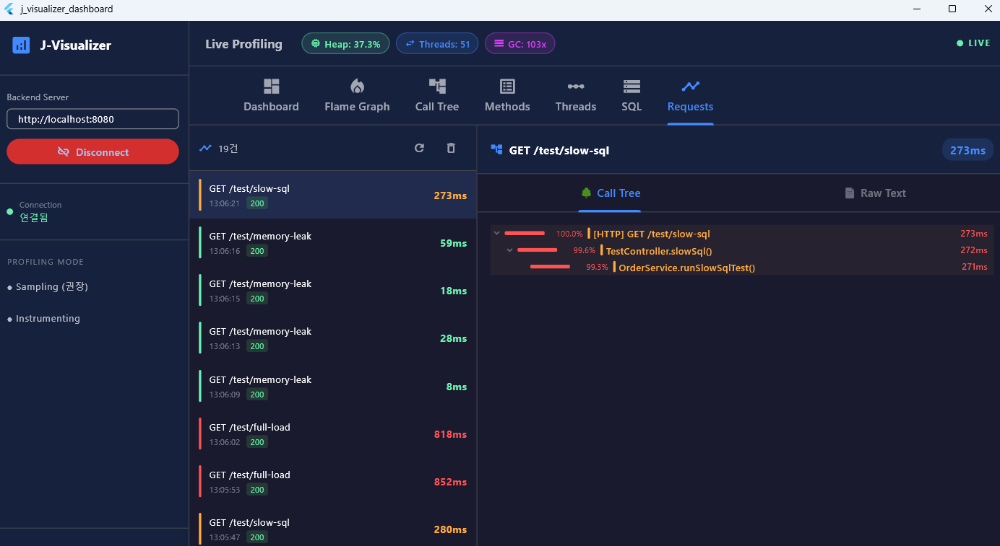
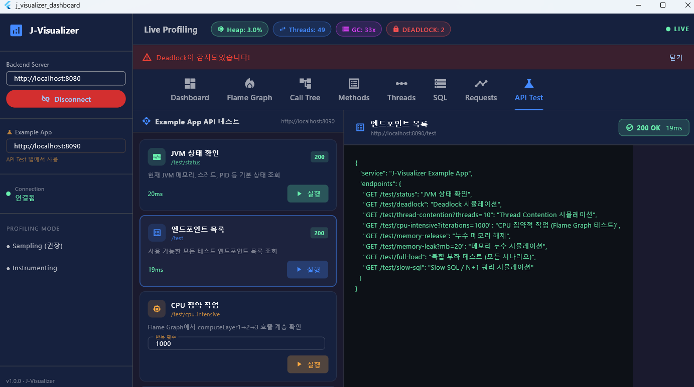

# 🔍 J-Visualizer — 실시간 Java 애플리케이션 성능 분석 시스템

> JVM 기반 애플리케이션의 CPU · Memory · Thread · SQL을 실시간 모니터링하고,
> 병목 현상을 시각화하여 최적화 가이드를 제공합니다.

---

## 📸 스크린샷

### Dashboard



### Flame Graph



### Call Tree



### Methods



### Threads



### SQL Profile



### Request History



### API Test



---

## 📁 프로젝트 구조

```
j-visualizer/
│
├── docker-compose.yml                          # 전체 스택 실행 (backend + example-app)
├── README.md
│
├── docs/                                       # 📊 Mermaid 다이어그램 산출물
│   ├── 01_system_architecture.md              # 전체 아키텍처 + 데이터 플로우
│   ├── 02_component_diagram.md                # 클래스 다이어그램
│   ├── 03_data_schema_api.md                  # ER 다이어그램 + REST API
│   ├── 04_deployment_diagram.md               # 배포 구성 + Docker Compose
│   ├── 05_ui_flow.md                          # Flutter 화면 플로우
│   ├── 06_invocation_tracking.md              # Requests 탭 설계
│   └── 07_sql_profiling.md                    # SQL Profiling 설계
│
├── java-agent/                                 # ☕ Java Agent (-javaagent 주입)
│   ├── pom.xml                                # Maven 빌드 (ASM 9.6, Jackson, WebSocket)
│   └── src/main/java/com/jvisualizer/agent/
│       ├── AgentMain.java                     # premain/agentmain 진입점, Agent 초기화
│       ├── AgentConfig.java                   # -javaagent 파라미터 파싱 및 설정 보관
│       ├── ProfilingOrchestrator.java         # 전체 프로파일러 조율 + 스케줄링
│       ├── DataSender.java                    # Backend HTTP 비동기 데이터 전송
│       ├── cpu/
│       │   └── CpuProfiler.java              # Thread Sampling + FlameGraph 트리 빌드
│       ├── memory/
│       │   └── MemoryProfiler.java           # MXBean Heap/GC/Thread 메트릭 수집
│       ├── thread/
│       │   └── ThreadProfiler.java           # Thread Dump + Deadlock 감지
│       └── sql/
│           └── SqlProfiler.java              # ASM JDBC 바이트코드 인터셉터
│                                             # (MySQL/PostgreSQL/Oracle 대상, H2 제외)
│
├── backend/                                    # 🖥️ Spring Boot 3.2 Backend
│   ├── Dockerfile
│   ├── pom.xml
│   └── src/main/
│       ├── resources/
│       │   └── application.yml               # 서버 설정, DB, 메트릭 보존 기간
│       └── java/com/jvisualizer/backend/
│           ├── JVisualizerBackendApplication.java   # Spring Boot 진입점 + @EnableScheduling
│           ├── config/
│           │   ├── CorsConfig.java           # CORS 전역 설정 (/api/**)
│           │   ├── JacksonConfig.java        # ObjectMapper 커스터마이즈 (ISO 8601 날짜)
│           │   └── WebSocketConfig.java      # WS 엔드포인트 등록 (/ws/dashboard, /ws/agent)
│           ├── controller/
│           │   ├── ProfilerController.java   # Agent 등록 + 메트릭/프로파일/스레드/SQL 수신
│           │   └── InvocationController.java # HTTP 요청 호출 트리 수신/조회/삭제
│           ├── dto/
│           │   ├── BottleneckReportDto.java  # 병목 분석 결과 응답 DTO (record)
│           │   └── SqlSummaryDto.java        # SQL 통계 요약 응답 DTO (record)
│           ├── model/                        # JPA 엔티티 (H2 인메모리 DB)
│           │   ├── JvmMetrics.java           # Heap/Thread/GC/CPU 메트릭
│           │   ├── CpuProfile.java           # FlameGraph JSON 저장
│           │   ├── ThreadSnapshot.java       # Thread Dump JSON 저장
│           │   ├── SqlEvent.java             # SQL 실행 이벤트 (슬로우 쿼리 포함)
│           │   └── InvocationRecord.java     # HTTP 요청별 호출 트리 (treeText/treeJson)
│           ├── repository/                   # Spring Data JPA 리포지토리
│           │   ├── JvmMetricsRepository.java
│           │   ├── CpuProfileRepository.java
│           │   ├── ThreadSnapshotRepository.java
│           │   ├── SqlEventRepository.java
│           │   └── InvocationRecordRepository.java
│           ├── service/
│           │   └── ProfilingDataService.java # 저장/조회/병목분석/이상감지/정기정리
│           └── websocket/
│               └── ProfilerWebSocketHandler.java  # Dashboard 실시간 Push 브로드캐스트
│
├── example-app/                                # 🧪 테스트용 Spring Boot 앱 (포트 8090)
│   ├── Dockerfile
│   ├── pom.xml                                # Spring Boot 3.2.3, H2, JPA, AOP
│   └── src/main/
│       ├── resources/
│       │   └── application.yml               # H2 인메모리 DB, Hibernate, 포트 8090
│       └── java/com/jvisualizer/example/
│           ├── ExampleApplication.java        # Spring Boot 진입점 + @EnableScheduling
│           ├── DataInitializer.java           # 앱 시작 시 샘플 상품 200개 자동 생성
│           ├── controller/
│           │   └── TestController.java        # 8가지 성능 테스트 시나리오 REST API
│           ├── model/
│           │   └── Product.java              # 상품 JPA 엔티티 (id/name/price/stock/category)
│           ├── repository/
│           │   └── ProductRepository.java    # 상품 JPA 리포지토리 (커스텀 쿼리 포함)
│           ├── service/
│           │   └── OrderService.java         # 6가지 병목 시나리오 비즈니스 로직
│           │                                 # (CPU/메모리/SlowSQL/스레드경합/데드락/복합)
│           ├── sql/
│           │   ├── SqlCapture.java           # Hibernate StatementInspector - SQL ThreadLocal 캡처
│           │   └── SqlProfilingAspect.java   # Repository AOP - SQL 실행시간 측정 및 Backend 전송
│           └── track/
│               ├── InvocationNode.java       # 메서드 호출 트리 단일 노드 (재귀 구조)
│               ├── InvocationContext.java    # ThreadLocal 기반 요청별 호출 컨텍스트
│               ├── TrackAspect.java          # Controller/Service/Repository AOP 호출 추적
│               └── TrackConfig.java          # OncePerRequestFilter - 요청 완료 후 Backend 전송
│
└── flutter-dashboard/                          # 📱 Flutter 대시보드 (Windows/Web)
    ├── pubspec.yaml                            # 의존성 (fl_chart, provider, http, web_socket_channel)
    └── lib/
        ├── main.dart                           # 앱 진입점, MultiProvider, MaterialApp 다크 테마
        ├── models/
        │   └── profiler_models.dart           # JvmMetrics/FlameNode/SqlEvent/ThreadInfo/ProfilerAlert
        ├── providers/
        │   └── profiler_provider.dart         # ChangeNotifier - 전역 상태 관리, 스트림 구독
        ├── services/
        │   └── websocket_service.dart         # WebSocket 연결/재연결, 메시지 파싱, 스트림 분배
        ├── screens/
        │   ├── main_layout.dart               # 전체 레이아웃 (사이드바 + 헤더 + 8개 탭)
        │   ├── dashboard_tab.dart             # 실시간 Heap/Thread 라인차트, 파이/바 차트
        │   ├── flame_graph_tab.dart           # Canvas 기반 FlameGraph, LIVE/히스토리 선택
        │   ├── call_tree_tab.dart             # 계층 호출 트리, 패키지 하이라이트, 히스토리
        │   ├── method_list_tab.dart           # 메서드별 Total/Self 시간 정렬 테이블
        │   ├── thread_tab.dart                # BLOCKED 강조, Stack Trace 펼침, Deadlock 표시
        │   ├── sql_tab.dart                   # SQL 이벤트 목록, Slow Query 필터, 상세 패널
        │   ├── invocation_tab.dart            # HTTP 요청 이력, JSON 호출 트리 / Raw Text 탭
        │   └── api_test_tab.dart              # Example-App REST API 시나리오 테스트 UI
        └── widgets/
            ├── header_widget.dart             # 상단 실시간 메트릭 칩 (Heap/Thread/GC/Deadlock)
            └── sidebar_widget.dart            # Backend URL / Example-App URL 입력, 연결 버튼
```

---

## 🚀 빠른 시작

### Docker Compose (권장)

```bash
# 전체 스택 빌드 및 실행
docker compose up --build -d

# 재시작 시
docker compose down
docker compose up -d

# 서비스 확인
# Backend API:   http://localhost:8080/api/status
# Example App:   http://localhost:8090/test
```

### Flutter Dashboard 실행

```bash
cd flutter-dashboard
flutter pub get
flutter create . --platforms=windows,web   # 최초 1회
flutter run -d windows                     # Windows Desktop
flutter run -d web-server --web-port=7777  # Web Browser
```

### Flutter 연결 설정

1. 사이드바 **Backend Server** → `http://localhost:8080` 입력 후 **Connect**
2. 사이드바 **Example-App URL** → `http://localhost:8090` 입력
3. **API Test** 탭에서 시나리오 실행

---

## 🧪 테스트 시나리오

| 엔드포인트                                     | 시나리오           | 확인 탭                              |
|:----------------------------------------- |:-------------- |:--------------------------------- |
| `GET /test/status`                        | JVM 상태 확인      | -                                 |
| `GET /test/cpu-intensive?iterations=2000` | CPU 집약 작업      | **Flame Graph**, **Call Tree**    |
| `GET /test/memory-leak?mb=50`             | 메모리 누수         | **Dashboard** — Heap 상승           |
| `GET /test/memory-release`                | 메모리 해제         | **Dashboard** — Heap 하락           |
| `GET /test/slow-sql`                      | N+1 + LIKE 풀스캔 | **SQL** — Slow Query 빨간 표시        |
| `GET /test/thread-contention?threads=20`  | 락 경합           | **Threads** — BLOCKED 상태          |
| `GET /test/deadlock`                      | Deadlock       | **Threads** — DEADLOCK 감지 + Alert |
| `GET /test/full-load`                     | 모든 시나리오 동시     | **Requests** — 전체 호출 트리           |

---

## 📱 Flutter 대시보드 탭 설명

| 탭               | 기능                                              |
|:--------------- |:----------------------------------------------- |
| **Dashboard**   | 실시간 Heap/Thread 라인 차트, Thread 상태 파이차트, 메모리 바차트  |
| **Flame Graph** | Canvas 기반 CPU 샘플링 시각화, LIVE/히스토리 드롭다운, 노드 상세 패널 |
| **Call Tree**   | 계층 호출 트리, 패키지 하이라이트, 샘플 비율 바, 히스토리 조회           |
| **Methods**     | Self/Total Time 정렬 테이블, 비율별 색상 구분               |
| **Threads**     | BLOCKED 강조, Stack Trace 펼침/접힘, Deadlock 표시      |
| **SQL**         | 실제 SQL 쿼리 표시, Slow Query 필터, 실행시간/호출위치 상세 패널    |
| **Requests**    | HTTP 요청별 호출 트리 저장/조회, JSON 트리뷰 / Raw Text 탭     |
| **API Test**    | Example-App 8개 시나리오 버튼 실행, 파라미터 입력, 응답 결과 표시    |

---

## ⚙️ Agent 파라미터

```
-javaagent:j-visualizer-agent-all.jar=<key>=<value>,...
```

| 파라미터               | 기본값                     | 설명                           |
|:------------------ |:----------------------- |:---------------------------- |
| `server`           | `http://localhost:8080` | Backend 서버 URL               |
| `mode`             | `sampling`              | `sampling` / `instrumenting` |
| `interval`         | `10`                    | Sampling 주기 (ms)             |
| `package`          | `""` (전체)               | 집중 분석할 패키지 prefix            |
| `flushInterval`    | `5000`                  | Flame Graph 전송 주기 (ms)       |
| `sqlProfiling`     | `true`                  | SQL Profiling 활성화            |
| `slowSqlThreshold` | `1000`                  | Slow SQL 기준 (ms)             |

---

## 🔌 REST API 명세

### Agent → Backend

| Method | Path                  | 설명                                   |
|:------ |:--------------------- |:------------------------------------ |
| POST   | `/api/agent/register` | Agent 등록 (appName, pid, jvm_version) |
| POST   | `/api/metrics`        | JVM 메트릭 전송 (1초 주기)                   |
| POST   | `/api/profile`        | CPU Flame Graph 전송                   |
| POST   | `/api/threads`        | Thread Dump 전송                       |
| POST   | `/api/sql`            | SQL 이벤트 전송                           |
| POST   | `/api/invocations`    | HTTP 요청 호출 트리 전송                     |

### Frontend → Backend

| Method | Path                              | 설명                               |
|:------ |:--------------------------------- |:-------------------------------- |
| GET    | `/api/status`                     | 서버 상태 + 연결 클라이언트 수               |
| GET    | `/api/metrics/history?minutes=10` | 최근 N분 메트릭 이력                     |
| GET    | `/api/profile/latest`             | 최신 CPU 프로파일                      |
| GET    | `/api/profile/history`            | CPU 프로파일 목록 (최근 10건)             |
| GET    | `/api/threads/latest`             | 최신 Thread Dump                   |
| GET    | `/api/sql/events`                 | SQL 이벤트 최근 100건                  |
| GET    | `/api/sql/stats`                  | SQL 통계 (전체/슬로우 건수, 느린 쿼리 Top 20) |
| GET    | `/api/bottlenecks`                | 병목 분석 리포트                        |
| GET    | `/api/invocations`                | 요청 호출 트리 목록 (최근 100건)            |
| GET    | `/api/invocations/{id}`           | 특정 요청 상세 조회                      |
| DELETE | `/api/invocations`                | 이력 전체 삭제                         |

### WebSocket `ws://host/ws/dashboard`

| 메시지 타입            | 설명                                         |
|:----------------- |:------------------------------------------ |
| `CONNECTION_ACK`  | 연결 성공 확인                                   |
| `AGENT_CONNECTED` | Agent 등록 이벤트                               |
| `METRICS`         | JVM 실시간 메트릭                                |
| `CPU_PROFILE`     | Flame Graph 데이터                            |
| `SQL_EVENT`       | SQL 실행 이벤트                                 |
| `THREAD_DUMP`     | Thread 스냅샷                                 |
| `INVOCATION`      | HTTP 요청 호출 트리                              |
| `ALERT`           | 이상 감지 알림 (HIGH_HEAP / DEADLOCK / SLOW_SQL) |

---

## 📊 개발 산출물 (docs/)

| 파일                          | 내용                                |
|:--------------------------- |:--------------------------------- |
| `01_system_architecture.md` | 전체 시스템 구성도, 데이터 플로우               |
| `02_component_diagram.md`   | Agent/Backend/Flutter 클래스 다이어그램   |
| `03_data_schema_api.md`     | ER 다이어그램, API 그래프, WebSocket 상태도  |
| `04_deployment_diagram.md`  | Docker Compose, CI/CD 파이프라인       |
| `05_ui_flow.md`             | Flutter 화면 전환, Flame Graph 알고리즘   |
| `06_invocation_tracking.md` | Requests 탭 시퀀스, ThreadLocal 트리 구조 |
| `07_sql_profiling.md`       | SQL 캡처 흐름, StatementInspector 구조  |

---

## 🛠️ 기술 스택

| 레이어            | 기술                                                        |
|:-------------- |:--------------------------------------------------------- |
| **Java Agent** | Java 17 Instrumentation API, ASM 9.6, MXBean              |
| **Backend**    | Spring Boot 3.2, WebSocket, Spring Data JPA, H2           |
| **Frontend**   | Flutter 3.x, fl_chart, Provider, http, web_socket_channel |
| **SQL 추적**     | Hibernate StatementInspector, Spring AOP                  |
| **호출 추적**      | Spring AOP + ThreadLocal InvocationContext                |
| **컨테이너**       | Docker, Docker Compose (멀티스테이지 빌드)                        |

---

## 🐛 알려진 이슈 / 트러블슈팅

| 증상                                        | 원인                                      | 해결                                  |
|:----------------------------------------- |:--------------------------------------- |:----------------------------------- |
| `TypeNotPresentException: ValueNull`      | H2 2.x 내부 클래스를 ASM이 로드 시도               | SqlProfiler TARGET_CLASSES에서 H2 제외  |
| `VerifyError: Expecting a stackmap frame` | `COMPUTE_FRAMES` + `SKIP_FRAMES` 조합 불일치 | `COMPUTE_MAXS` + `EXPAND_FRAMES` 사용 |
| `404 Not Found /test/*`                   | TestController.java 0바이트로 컴파일 누락        | TestController.java 교체 후 Docker 재빌드 |
| 컨테이너 이름 충돌                                | WSL 재시작 후 이전 컨테이너 잔존                    | `docker compose down` 후 `up -d`     |
