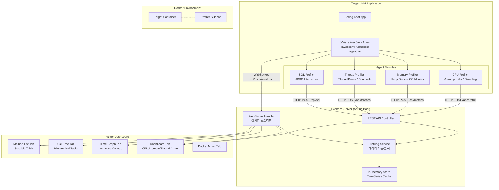
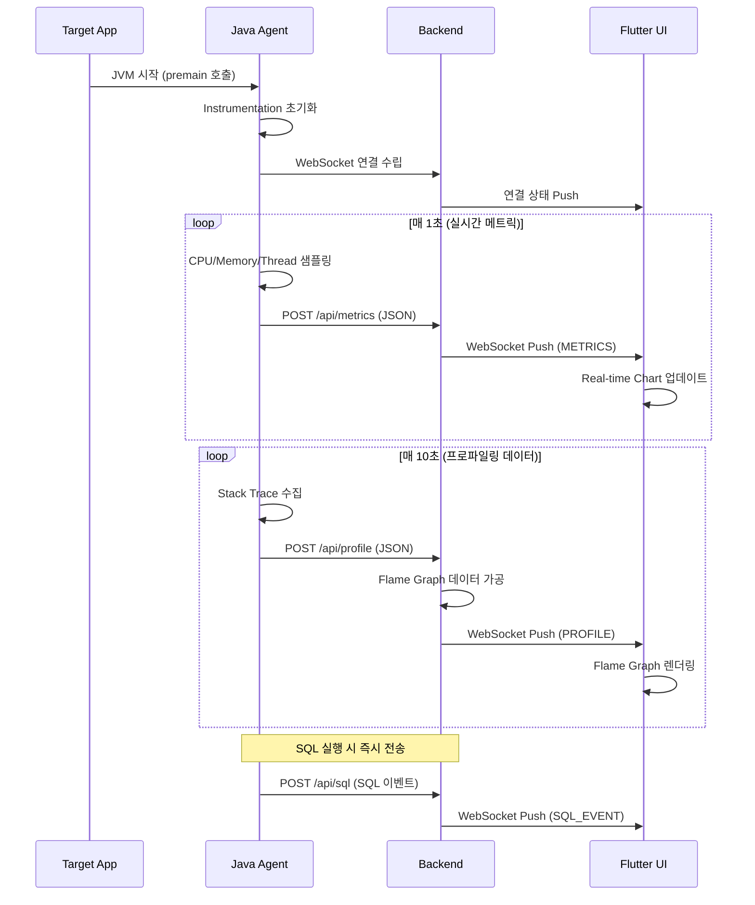

# J-Visualizer 시스템 아키텍처

## 전체 시스템 구성도

```mermaid
graph TB
    subgraph "Target JVM Application"
        APP[Spring Boot App]
        AGENT[J-Visualizer Java Agent<br/>-javaagent:j-visualizer-agent.jar]
        APP --- AGENT

        subgraph "Agent Modules"
            CPU_MOD[CPU Profiler<br/>Async-profiler / Sampling]
            MEM_MOD[Memory Profiler<br/>Heap Dump / GC Monitor]
            THREAD_MOD[Thread Profiler<br/>Thread Dump / Deadlock]
            SQL_MOD[SQL Profiler<br/>JDBC Interceptor]
        end

        AGENT --> CPU_MOD
        AGENT --> MEM_MOD
        AGENT --> THREAD_MOD
        AGENT --> SQL_MOD
    end

    subgraph "Backend Server (Spring Boot)"
        REST[REST API Controller]
        WS[WebSocket Handler<br/>실시간 스트리밍]
        SVC[Profiling Service<br/>데이터 가공/분석]
        STORE[In-Memory Store<br/>TimeSeries Cache]

        REST --> SVC
        WS --> SVC
        SVC --> STORE
    end

    subgraph "Flutter Dashboard"
        DASH[Dashboard Tab<br/>CPU/Memory/Thread Chart]
        FLAME[Flame Graph Tab<br/>Interactive Canvas]
        TREE[Call Tree Tab<br/>Hierarchical Table]
        METHOD[Method List Tab<br/>Sortable Table]
        DOCKER_UI[Docker Mgmt Tab]
    end

    subgraph "Docker Environment"
        CONTAINER[Target Container]
        SIDECAR[Profiler Sidecar]
        CONTAINER -.- SIDECAR
    end

    CPU_MOD -- "HTTP POST /api/profile" --> REST
    MEM_MOD -- "HTTP POST /api/metrics" --> REST
    THREAD_MOD -- "HTTP POST /api/threads" --> REST
    SQL_MOD -- "HTTP POST /api/sql" --> REST

    AGENT -- "WebSocket ws://host/ws/stream" --> WS

    REST --> DASH
    WS --> DASH
    WS --> FLAME
    WS --> TREE
    WS --> METHOD
```

## 데이터 플로우

```mermaid
sequenceDiagram
    participant APP as Target App
    participant AGENT as Java Agent
    participant BE as Backend
    participant FE as Flutter UI

    APP->>AGENT: JVM 시작 (premain 호출)
    AGENT->>AGENT: Instrumentation 초기화
    AGENT->>BE: WebSocket 연결 수립
    BE->>FE: 연결 상태 Push

    loop 매 1초 (실시간 메트릭)
        AGENT->>AGENT: CPU/Memory/Thread 샘플링
        AGENT->>BE: POST /api/metrics (JSON)
        BE->>FE: WebSocket Push (METRICS)
        FE->>FE: Real-time Chart 업데이트
    end

    loop 매 10초 (프로파일링 데이터)
        AGENT->>AGENT: Stack Trace 수집
        AGENT->>BE: POST /api/profile (JSON)
        BE->>BE: Flame Graph 데이터 가공
        BE->>FE: WebSocket Push (PROFILE)
        FE->>FE: Flame Graph 렌더링
    end

    Note over AGENT,BE: SQL 실행 시 즉시 전송
    AGENT->>BE: POST /api/sql (SQL 이벤트)
    BE->>FE: WebSocket Push (SQL_EVENT)
```
