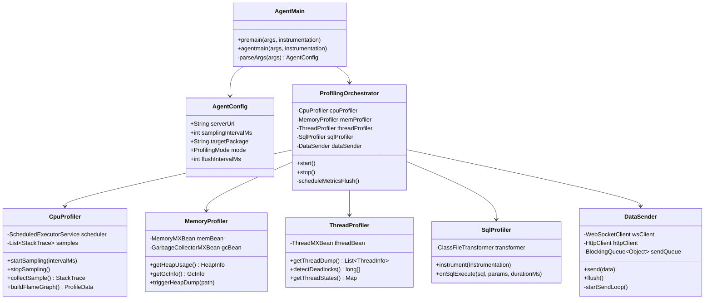
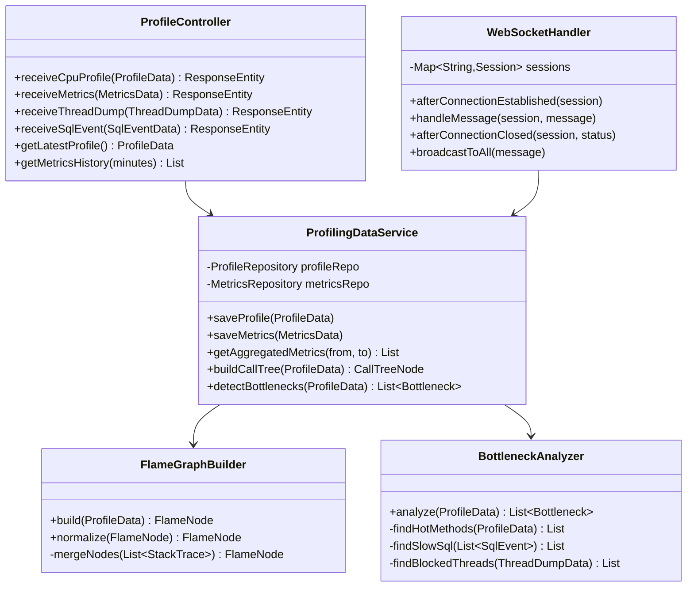
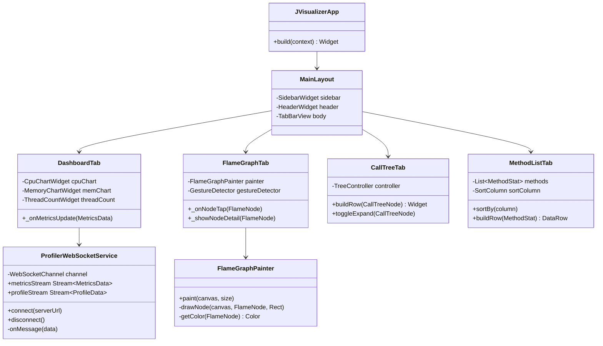

# J-Visualizer 컴포넌트 상세 다이어그램

## Java Agent 내부 구조

```mermaid
classDiagram
    class AgentMain {
        +premain(args, instrumentation)
        +agentmain(args, instrumentation)
        -parseArgs(args) AgentConfig
    }

    class AgentConfig {
        +String serverUrl
        +int samplingIntervalMs
        +String targetPackage
        +ProfilingMode mode
        +int flushIntervalMs
    }

    class ProfilingOrchestrator {
        -CpuProfiler cpuProfiler
        -MemoryProfiler memProfiler
        -ThreadProfiler threadProfiler
        -SqlProfiler sqlProfiler
        -DataSender dataSender
        +start()
        +stop()
        -scheduleMetricsFlush()
    }

    class CpuProfiler {
        -ScheduledExecutorService scheduler
        -List~StackTrace~ samples
        +startSampling(intervalMs)
        +stopSampling()
        +collectSample() StackTrace
        +buildFlameGraph() ProfileData
    }

    class MemoryProfiler {
        -MemoryMXBean memBean
        -GarbageCollectorMXBean gcBean
        +getHeapUsage() HeapInfo
        +getGcInfo() GcInfo
        +triggerHeapDump(path)
    }

    class ThreadProfiler {
        -ThreadMXBean threadBean
        +getThreadDump() List~ThreadInfo~
        +detectDeadlocks() long[]
        +getThreadStates() Map
    }

    class SqlProfiler {
        +instrument(Instrumentation)
        +onSqlExecute(sql, params, durationMs)
        -ClassFileTransformer transformer
    }

    class DataSender {
        -WebSocketClient wsClient
        -HttpClient httpClient
        -BlockingQueue~Object~ sendQueue
        +send(data)
        +flush()
        -startSendLoop()
    }

    AgentMain --> AgentConfig
    AgentMain --> ProfilingOrchestrator
    ProfilingOrchestrator --> CpuProfiler
    ProfilingOrchestrator --> MemoryProfiler
    ProfilingOrchestrator --> ThreadProfiler
    ProfilingOrchestrator --> SqlProfiler
    ProfilingOrchestrator --> DataSender
```

## Backend 서비스 레이어

```mermaid
classDiagram
    class ProfileController {
        +receiveCpuProfile(ProfileData) ResponseEntity
        +receiveMetrics(MetricsData) ResponseEntity
        +receiveThreadDump(ThreadDumpData) ResponseEntity
        +receiveSqlEvent(SqlEventData) ResponseEntity
        +getLatestProfile() ProfileData
        +getMetricsHistory(minutes) List
    }

    class WebSocketHandler {
        -Map~String,Session~ sessions
        +afterConnectionEstablished(session)
        +handleMessage(session, message)
        +afterConnectionClosed(session, status)
        +broadcastToAll(message)
    }

    class ProfilingDataService {
        -ProfileRepository profileRepo
        -MetricsRepository metricsRepo
        +saveProfile(ProfileData)
        +saveMetrics(MetricsData)
        +getAggregatedMetrics(from, to) List
        +buildCallTree(ProfileData) CallTreeNode
        +detectBottlenecks(ProfileData) List~Bottleneck~
    }

    class FlameGraphBuilder {
        +build(ProfileData) FlameNode
        +normalize(FlameNode) FlameNode
        -mergeNodes(List~StackTrace~) FlameNode
    }

    class BottleneckAnalyzer {
        +analyze(ProfileData) List~Bottleneck~
        -findHotMethods(ProfileData) List
        -findSlowSql(List~SqlEvent~) List
        -findBlockedThreads(ThreadDumpData) List
    }

    ProfileController --> ProfilingDataService
    ProfilingDataService --> FlameGraphBuilder
    ProfilingDataService --> BottleneckAnalyzer
    WebSocketHandler --> ProfilingDataService
```

## Flutter UI 컴포넌트

```mermaid
classDiagram
    class JVisualizerApp {
        +build(context) Widget
    }

    class MainLayout {
        -SidebarWidget sidebar
        -HeaderWidget header
        -TabBarView body
    }

    class DashboardTab {
        -CpuChartWidget cpuChart
        -MemoryChartWidget memChart
        -ThreadCountWidget threadCount
        +_onMetricsUpdate(MetricsData)
    }

    class FlameGraphTab {
        -FlameGraphPainter painter
        -GestureDetector gestureDetector
        +_onNodeTap(FlameNode)
        +_showNodeDetail(FlameNode)
    }

    class FlameGraphPainter {
        +paint(canvas, size)
        -drawNode(canvas, FlameNode, Rect)
        -getColor(FlameNode) Color
    }

    class CallTreeTab {
        -TreeController controller
        +buildRow(CallTreeNode) Widget
        +toggleExpand(CallTreeNode)
    }

    class MethodListTab {
        -List~MethodStat~ methods
        -SortColumn sortColumn
        +sortBy(column)
        +buildRow(MethodStat) DataRow
    }

    class ProfilerWebSocketService {
        -WebSocketChannel channel
        +connect(serverUrl)
        +disconnect()
        -onMessage(data)
        +metricsStream Stream~MetricsData~
        +profileStream Stream~ProfileData~
    }

    JVisualizerApp --> MainLayout
    MainLayout --> DashboardTab
    MainLayout --> FlameGraphTab
    MainLayout --> CallTreeTab
    MainLayout --> MethodListTab
    DashboardTab --> ProfilerWebSocketService
    FlameGraphTab --> FlameGraphPainter
```
