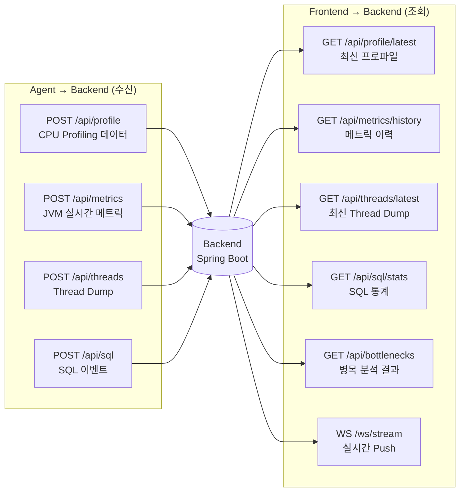
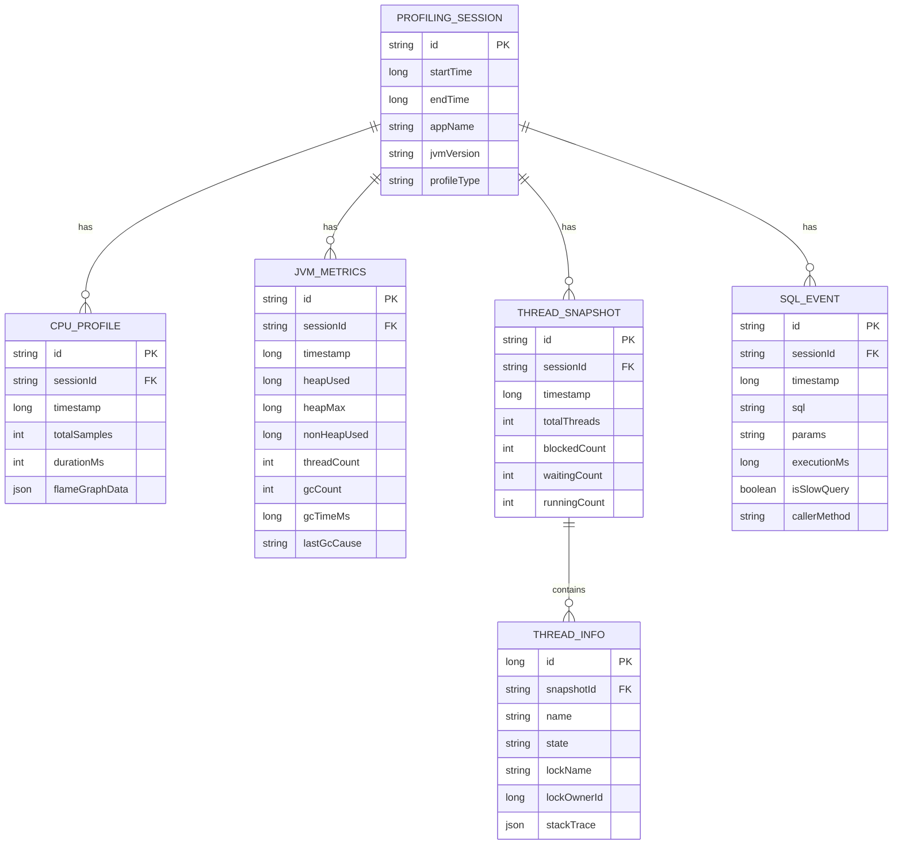
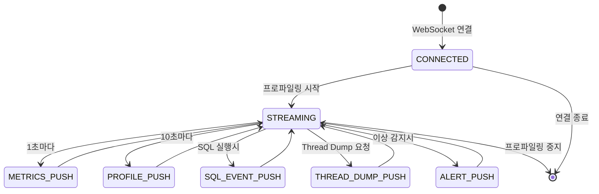

# J-Visualizer 데이터 스키마 & API 명세

## REST API 엔드포인트

```mermaid
graph LR
    subgraph "Agent → Backend (수신)"
        P1[POST /api/profile<br/>CPU Profiling 데이터]
        P2[POST /api/metrics<br/>JVM 실시간 메트릭]
        P3[POST /api/threads<br/>Thread Dump]
        P4[POST /api/sql<br/>SQL 이벤트]
    end

    subgraph "Frontend → Backend (조회)"
        G1[GET /api/profile/latest<br/>최신 프로파일]
        G2[GET /api/metrics/history<br/>메트릭 이력]
        G3[GET /api/threads/latest<br/>최신 Thread Dump]
        G4[GET /api/sql/stats<br/>SQL 통계]
        G5[GET /api/bottlenecks<br/>병목 분석 결과]
        WS[WS /ws/stream<br/>실시간 Push]
    end

    BE[(Backend<br/>Spring Boot)]

    P1 --> BE
    P2 --> BE
    P3 --> BE
    P4 --> BE
    BE --> G1
    BE --> G2
    BE --> G3
    BE --> G4
    BE --> G5
    BE --> WS
```

## 데이터 모델 관계도

```mermaid
erDiagram
    PROFILING_SESSION {
        string id PK
        long startTime
        long endTime
        string appName
        string jvmVersion
        string profileType
    }

    CPU_PROFILE {
        string id PK
        string sessionId FK
        long timestamp
        int totalSamples
        int durationMs
        json flameGraphData
    }

    JVM_METRICS {
        string id PK
        string sessionId FK
        long timestamp
        long heapUsed
        long heapMax
        long nonHeapUsed
        int threadCount
        int gcCount
        long gcTimeMs
        string lastGcCause
    }

    THREAD_SNAPSHOT {
        string id PK
        string sessionId FK
        long timestamp
        int totalThreads
        int blockedCount
        int waitingCount
        int runningCount
    }

    THREAD_INFO {
        long id PK
        string snapshotId FK
        string name
        string state
        string lockName
        long lockOwnerId
        json stackTrace
    }

    SQL_EVENT {
        string id PK
        string sessionId FK
        long timestamp
        string sql
        string params
        long executionMs
        boolean isSlowQuery
        string callerMethod
    }

    PROFILING_SESSION ||--o{ CPU_PROFILE : has
    PROFILING_SESSION ||--o{ JVM_METRICS : has
    PROFILING_SESSION ||--o{ THREAD_SNAPSHOT : has
    PROFILING_SESSION ||--o{ SQL_EVENT : has
    THREAD_SNAPSHOT ||--o{ THREAD_INFO : contains
```

## WebSocket 메시지 타입

```mermaid
stateDiagram-v2
    [*] --> CONNECTED : WebSocket 연결
    CONNECTED --> STREAMING : 프로파일링 시작

    STREAMING --> METRICS_PUSH : 1초마다
    METRICS_PUSH --> STREAMING

    STREAMING --> PROFILE_PUSH : 10초마다
    PROFILE_PUSH --> STREAMING

    STREAMING --> SQL_EVENT_PUSH : SQL 실행시
    SQL_EVENT_PUSH --> STREAMING

    STREAMING --> THREAD_DUMP_PUSH : Thread Dump 요청
    THREAD_DUMP_PUSH --> STREAMING

    STREAMING --> ALERT_PUSH : 이상 감지시
    ALERT_PUSH --> STREAMING

    STREAMING --> [*] : 프로파일링 중지
    CONNECTED --> [*] : 연결 종료
```
