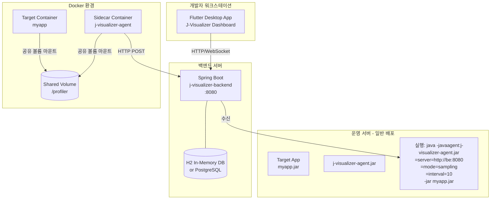
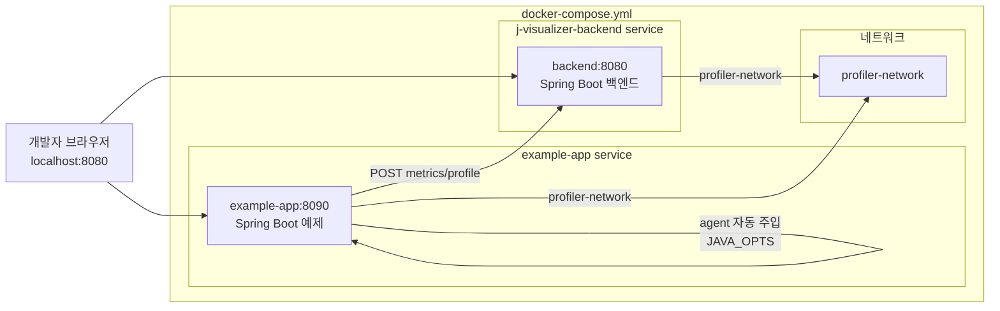
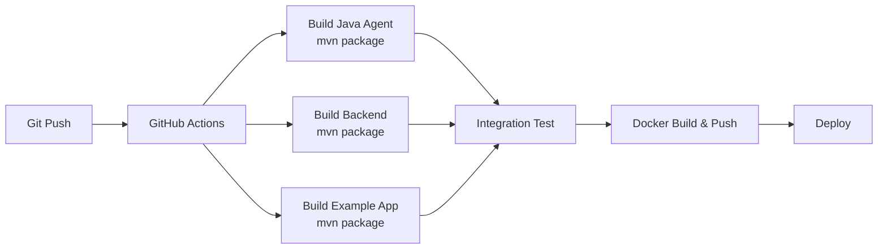

# J-Visualizer 배포 구성도

## 배포 아키텍처

```mermaid
graph TB
    subgraph "개발자 워크스테이션"
        FLUTTER[Flutter Desktop App<br/>J-Visualizer Dashboard]
    end

    subgraph "백엔드 서버"
        BE_SVC[Spring Boot<br/>j-visualizer-backend<br/>:8080]
        H2[(H2 In-Memory DB<br/>or PostgreSQL)]
        BE_SVC --- H2
    end

    subgraph "운영 서버 - 일반 배포"
        JAR[Target App<br/>myapp.jar]
        AGENT_JAR[j-visualizer-agent.jar]
        CMD["실행: java -javaagent:j-visualizer-agent.jar<br/>=server=http://be:8080<br/>=mode=sampling<br/>=interval=10<br/>-jar myapp.jar"]
    end

    subgraph "Docker 환경"
        TARGET_CONT[Target Container<br/>myapp]
        SIDECAR_CONT[Sidecar Container<br/>j-visualizer-agent]
        SHARED_VOL[(Shared Volume<br/>/profiler)]

        TARGET_CONT -- "공유 볼륨 마운트" --> SHARED_VOL
        SIDECAR_CONT -- "공유 볼륨 마운트" --> SHARED_VOL
    end

    FLUTTER -- "HTTP/WebSocket" --> BE_SVC
    BE_SVC -- "수신" --> CMD
    SIDECAR_CONT -- "HTTP POST" --> BE_SVC
```

## Docker Compose 구성

```mermaid
graph LR
    subgraph "docker-compose.yml"
        subgraph "example-app service"
            EA[example-app:8090<br/>Spring Boot 예제]
        end

        subgraph "j-visualizer-backend service"
            BE[backend:8080<br/>Spring Boot 백엔드]
        end

        subgraph "네트워크"
            NET[profiler-network]
        end

        EA -- "profiler-network" --> NET
        BE -- "profiler-network" --> NET
        EA -- "agent 자동 주입<br/>JAVA_OPTS" --> EA
        EA -- "POST metrics/profile" --> BE
    end

    DEV[개발자 브라우저<br/>localhost:8080] --> BE
    DEV --> EA
```

## CI/CD 파이프라인

```mermaid
graph LR
    GIT[Git Push] --> CI[GitHub Actions]
    CI --> BUILD_AGENT[Build Java Agent<br/>mvn package]
    CI --> BUILD_BE[Build Backend<br/>mvn package]
    CI --> BUILD_EX[Build Example App<br/>mvn package]

    BUILD_AGENT --> TEST[Integration Test]
    BUILD_BE --> TEST
    BUILD_EX --> TEST

    TEST --> DOCKER[Docker Build & Push]
    DOCKER --> DEPLOY[Deploy]
```
