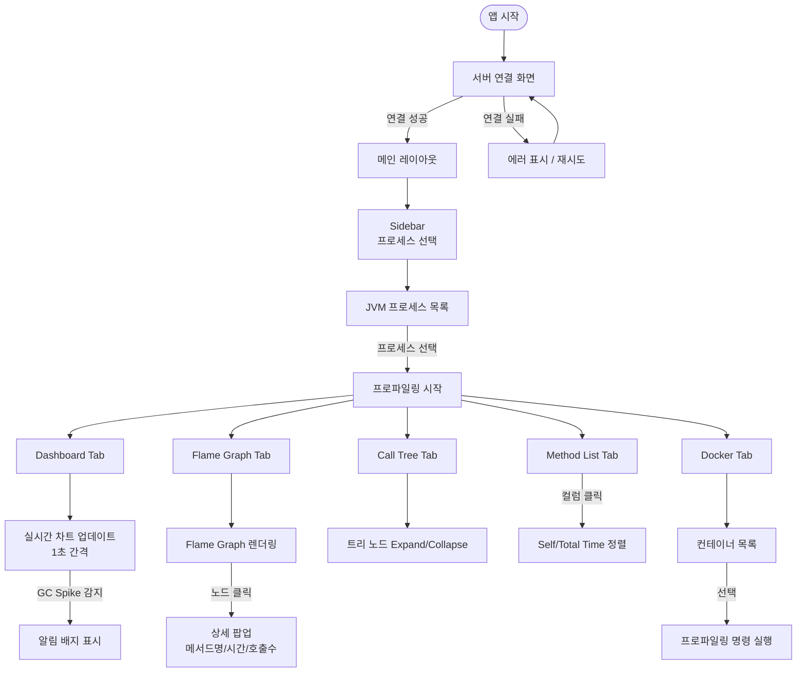
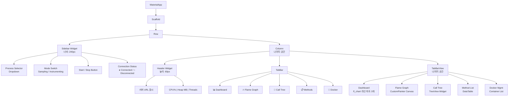
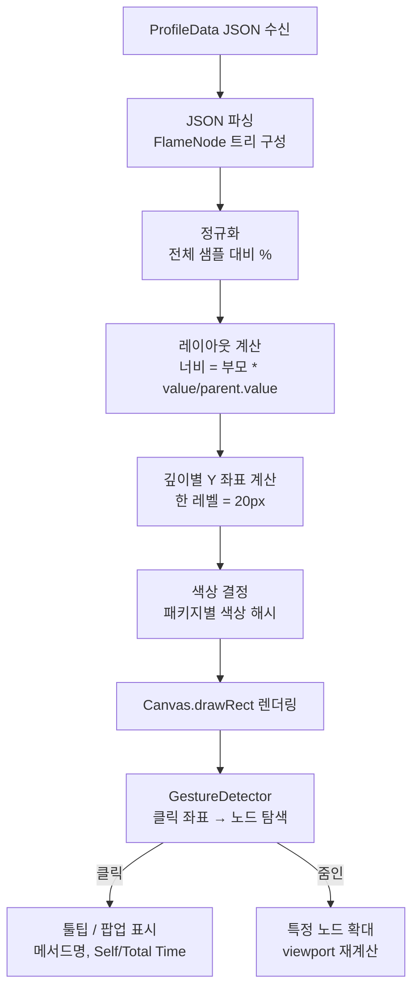

# J-Visualizer UI 플로우 & 화면 구성

## Flutter 화면 전환 플로우

```mermaid
flowchart TD
    START([앱 시작]) --> CONN[서버 연결 화면]
    CONN -- 연결 성공 --> MAIN[메인 레이아웃]
    CONN -- 연결 실패 --> CONN_ERR[에러 표시 / 재시도]
    CONN_ERR --> CONN

    MAIN --> SIDEBAR[Sidebar\n프로세스 선택]
    SIDEBAR --> PROC_LIST[JVM 프로세스 목록]
    PROC_LIST -- 프로세스 선택 --> START_PROF[프로파일링 시작]

    START_PROF --> TAB_DASH[Dashboard Tab]
    START_PROF --> TAB_FLAME[Flame Graph Tab]
    START_PROF --> TAB_TREE[Call Tree Tab]
    START_PROF --> TAB_METHOD[Method List Tab]
    START_PROF --> TAB_DOCKER[Docker Tab]

    TAB_DASH --> CHART_UPDATE[실시간 차트 업데이트\n1초 간격]
    TAB_FLAME --> FLAME_RENDER[Flame Graph 렌더링]
    FLAME_RENDER -- 노드 클릭 --> FLAME_DETAIL[상세 팝업\n메서드명/시간/호출수]
    TAB_TREE --> TREE_EXPAND[트리 노드 Expand/Collapse]
    TAB_METHOD -- 컬럼 클릭 --> SORT[Self/Total Time 정렬]
    TAB_DOCKER --> CONT_LIST[컨테이너 목록]
    CONT_LIST -- 선택 --> INJECT_CMD[프로파일링 명령 실행]

    CHART_UPDATE -- GC Spike 감지 --> ALERT[알림 배지 표시]
```

## Flutter Main Layout 구조

```mermaid
graph TD
    APP[MaterialApp] --> SCAFFOLD[Scaffold]
    SCAFFOLD --> ROW[Row]

    ROW --> SIDEBAR_W[Sidebar Widget\n너비: 240px]
    ROW --> COLUMN[Column\n나머지 공간]

    SIDEBAR_W --> PROCESS_SELECTOR[Process Selector\nDropdown]
    SIDEBAR_W --> MODE_SWITCH[Mode Switch\nSampling / Instrumenting]
    SIDEBAR_W --> START_BTN[Start / Stop Button]
    SIDEBAR_W --> CONN_STATUS[Connection Status\n● Connected / ○ Disconnected]

    COLUMN --> HEADER_W[Header Widget\n높이: 60px]
    COLUMN --> TAB_BAR[TabBar]
    COLUMN --> TAB_VIEW[TabBarView\n나머지 공간]

    HEADER_W --> SERVER_INFO[서버 URL 표시]
    HEADER_W --> QUICK_STATS["CPU% | Heap MB | Threads"]

    TAB_BAR --> T1[📊 Dashboard]
    TAB_BAR --> T2[🔥 Flame Graph]
    TAB_BAR --> T3[🌳 Call Tree]
    TAB_BAR --> T4[📋 Methods]
    TAB_BAR --> T5[🐳 Docker]

    TAB_VIEW --> DASH_TAB[Dashboard\nfl_chart 라인 차트 3개]
    TAB_VIEW --> FLAME_TAB[Flame Graph\nCustomPainter Canvas]
    TAB_VIEW --> TREE_TAB[Call Tree\nTreeView Widget]
    TAB_VIEW --> METHOD_TAB[Method List\nDataTable]
    TAB_VIEW --> DOCKER_TAB[Docker Mgmt\nContainer List]
```

## Flame Graph 렌더링 알고리즘

```mermaid
flowchart TD
    INPUT[ProfileData JSON 수신] --> PARSE[JSON 파싱\nFlameNode 트리 구성]
    PARSE --> NORM[정규화\n전체 샘플 대비 %]
    NORM --> LAYOUT[레이아웃 계산\n너비 = 부모 * value/parent.value]
    LAYOUT --> DEPTH[깊이별 Y 좌표 계산\n한 레벨 = 20px]
    DEPTH --> COLOR[색상 결정\n패키지별 색상 해시]
    COLOR --> PAINT[Canvas.drawRect 렌더링]
    PAINT --> GESTURE[GestureDetector\n클릭 좌표 → 노드 탐색]
    GESTURE -- 클릭 --> TOOLTIP[툴팁 / 팝업 표시\n메서드명, Self/Total Time]
    GESTURE -- 줌인 --> ZOOM[특정 노드 확대\nviewport 재계산]
```
