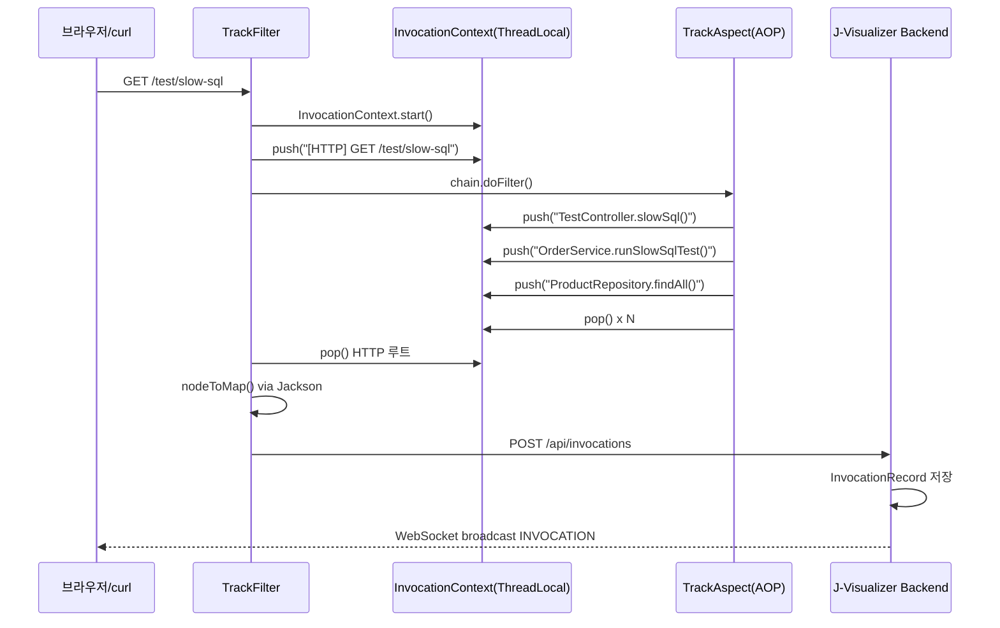
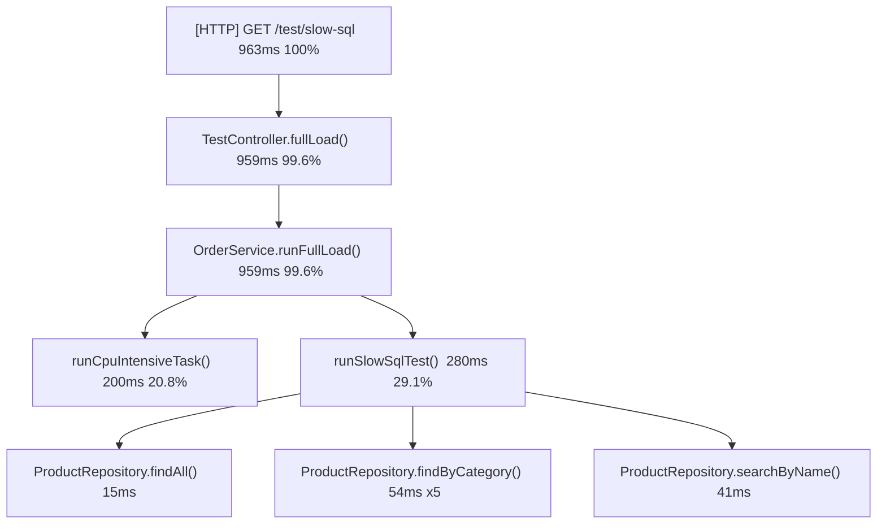
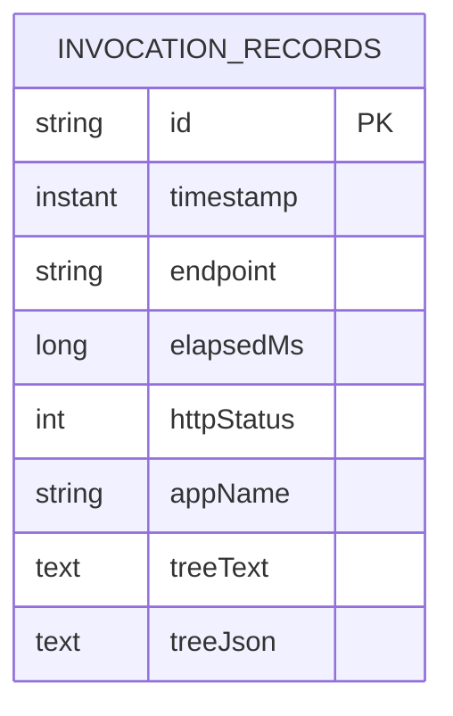
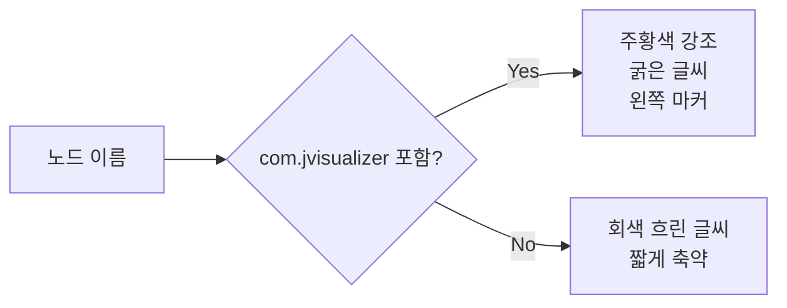

# Invocation Tracking (Requests 탭) 설계

## 호출 트리 수집 흐름

```mermaid
sequenceDiagram
    participant Client as 브라우저/curl
    participant Filter as TrackFilter
    participant Context as InvocationContext(ThreadLocal)
    participant Aspect as TrackAspect(AOP)
    participant Backend as J-Visualizer Backend

    Client->>Filter: GET /test/slow-sql
    Filter->>Context: InvocationContext.start()
    Filter->>Context: push("[HTTP] GET /test/slow-sql")
    Filter->>Aspect: chain.doFilter()
    Aspect->>Context: push("TestController.slowSql()")
    Aspect->>Context: push("OrderService.runSlowSqlTest()")
    Aspect->>Context: push("ProductRepository.findAll()")
    Aspect->>Context: pop() x N
    Filter->>Context: pop() HTTP 루트
    Filter->>Filter: nodeToMap() via Jackson
    Filter->>Backend: POST /api/invocations
    Backend->>Backend: InvocationRecord 저장
    Backend-->>Client: WebSocket broadcast INVOCATION
```

## InvocationContext 트리 구조

```mermaid
graph TD
    ROOT["[HTTP] GET /test/slow-sql  963ms 100%"]
    CTRL["TestController.fullLoad()  959ms 99.6%"]
    SVC["OrderService.runFullLoad()  959ms 99.6%"]
    CPU["runCpuIntensiveTask()  200ms 20.8%"]
    SQL["runSlowSqlTest()  280ms 29.1%"]
    REPO1["ProductRepository.findAll()  15ms"]
    REPO2["ProductRepository.findByCategory()  54ms x5"]
    REPO3["ProductRepository.searchByName()  41ms"]

    ROOT --> CTRL --> SVC
    SVC --> CPU
    SVC --> SQL
    SQL --> REPO1
    SQL --> REPO2
    SQL --> REPO3
```

## Backend 데이터 모델

```mermaid
erDiagram
    INVOCATION_RECORDS {
        string id PK
        instant timestamp
        string endpoint
        long elapsedMs
        int httpStatus
        string appName
        text treeText
        text treeJson
    }
```

## Flutter 강조 표시 규칙

```mermaid
graph LR
    A[노드 이름] --> B{com.jvisualizer 포함?}
    B -->|Yes| C[주황색 강조\n굵은 글씨\n왼쪽 마커]
    B -->|No| D[회색 흐린 글씨\n짧게 축약]
```
