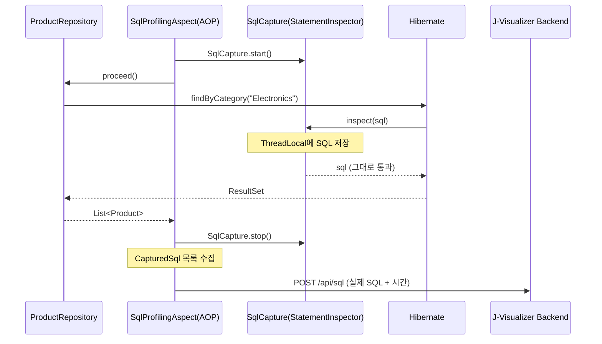
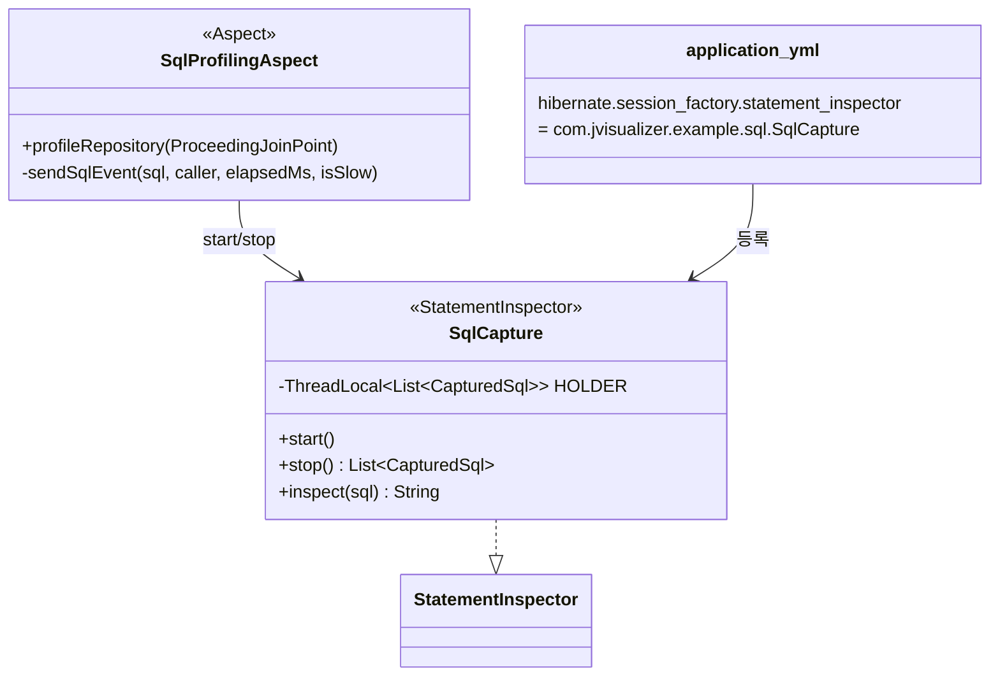
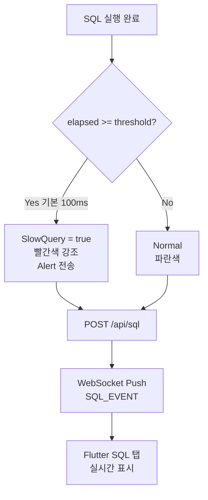

# SQL Profiling 설계

## SQL 캡처 흐름

```mermaid
sequenceDiagram
    participant Repo as ProductRepository
    participant Aspect as SqlProfilingAspect(AOP)
    participant Capture as SqlCapture(StatementInspector)
    participant Hibernate as Hibernate
    participant Backend as J-Visualizer Backend

    Aspect->>Capture: SqlCapture.start()
    Aspect->>Repo: proceed()
    Repo->>Hibernate: findByCategory("Electronics")
    Hibernate->>Capture: inspect(sql)
    Note over Capture: ThreadLocal에 SQL 저장
    Capture-->>Hibernate: sql (그대로 통과)
    Hibernate-->>Repo: ResultSet
    Repo-->>Aspect: List<Product>
    Aspect->>Capture: SqlCapture.stop()
    Note over Aspect: CapturedSql 목록 수집
    Aspect->>Backend: POST /api/sql (실제 SQL + 시간)
```

## 컴포넌트 구조

```mermaid
classDiagram
    class SqlCapture {
        <<StatementInspector>>
        -ThreadLocal~List~CapturedSql~~ HOLDER
        +start()
        +stop() List~CapturedSql~
        +inspect(sql) String
    }

    class SqlProfilingAspect {
        <<Aspect>>
        +profileRepository(ProceedingJoinPoint)
        -sendSqlEvent(sql, caller, elapsedMs, isSlow)
    }

    class application_yml {
        hibernate.session_factory.statement_inspector
        = com.jvisualizer.example.sql.SqlCapture
    }

    SqlProfilingAspect --> SqlCapture : start/stop
    SqlCapture ..|> StatementInspector
    application_yml --> SqlCapture : 등록
```

## Slow Query 판단 기준

```mermaid
flowchart TD
    SQL[SQL 실행 완료] --> TIME{elapsed >= threshold?}
    TIME -->|Yes 기본 100ms| SLOW[SlowQuery = true\n빨간색 강조\nAlert 전송]
    TIME -->|No| NORMAL[Normal\n파란색]
    SLOW --> SEND[POST /api/sql]
    NORMAL --> SEND
    SEND --> WS[WebSocket Push\nSQL_EVENT]
    WS --> FLUTTER[Flutter SQL 탭\n실시간 표시]
```
